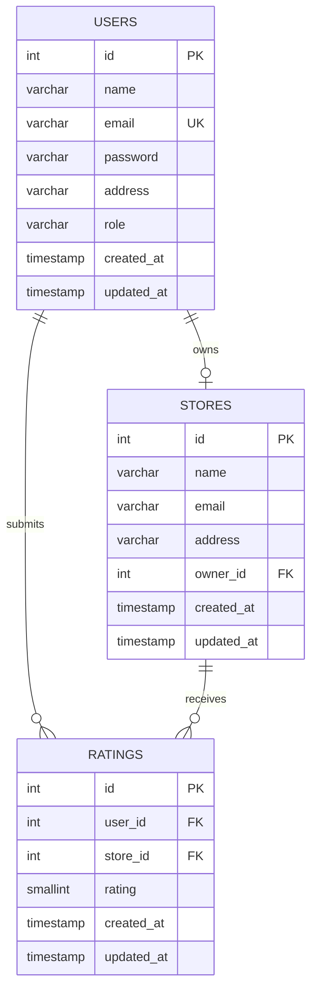

# Database Architecture (Phase 2)

This document outlines the relational database schema, constraints, indexes, and architectural decisions for the Store Rating Platform, built for PostgreSQL.

---

## 1. Entity-Relationship Diagram

---

## 2. Table Schemas

### 2.1 `users` Table
Stores all types of users in a single table, utilizing the `role` column for role-based access control.

| Column | Type | Constraints | Description |
| :--- | :--- | :--- | :--- |
| `id` | SERIAL | PRIMARY KEY | Unique identifier for the user. |
| `name` | VARCHAR(60) | NOT NULL | User's full name. Database constraint ensures min 20 and max 60 characters. |
| `email` | VARCHAR(255) | UNIQUE, NOT NULL | User's email address. Used for authentication. |
| `password` | VARCHAR(255) | NOT NULL | Password hash (bcrypt). *Note: length constraints apply at the application level before hashing.* |
| `address` | VARCHAR(400) | | User's address. |
| `role` | VARCHAR(20) | NOT NULL | Determines system permissions. |
| `created_at` | TIMESTAMP | DEFAULT CURRENT_TIMESTAMP | Record creation timestamp. |
| `updated_at` | TIMESTAMP | DEFAULT CURRENT_TIMESTAMP | Record update timestamp. |

### 2.2 `stores` Table
Stores information about registered stores and their associated Store Owner.

| Column | Type | Constraints | Description |
| :--- | :--- | :--- | :--- |
| `id` | SERIAL | PRIMARY KEY | Unique identifier for the store. |
| `name` | VARCHAR(255) | NOT NULL | The store's name. |
| `email` | VARCHAR(255) | NOT NULL | The store's contact email. |
| `address` | VARCHAR(400) | NOT NULL | The physical or primary address. |
| `owner_id` | INTEGER | UNIQUE, NOT NULL | Foreign key to `users.id`. Represents the Store Owner (1:1 relationship). |
| `created_at` | TIMESTAMP | DEFAULT CURRENT_TIMESTAMP | Record creation timestamp. |
| `updated_at` | TIMESTAMP | DEFAULT CURRENT_TIMESTAMP | Record update timestamp. |

### 2.3 `ratings` Table
Stores ratings submitted by Normal Users for Stores.

| Column | Type | Constraints | Description |
| :--- | :--- | :--- | :--- |
| `id` | SERIAL | PRIMARY KEY | Unique identifier for the rating entry. |
| `user_id` | INTEGER | NOT NULL | Foreign key to `users.id` (Normal User). |
| `store_id` | INTEGER | NOT NULL | Foreign key to `stores.id`. |
| `rating` | SMALLINT | NOT NULL | Integer rating from 1 to 5. |
| `created_at` | TIMESTAMP | DEFAULT CURRENT_TIMESTAMP | Record creation timestamp. |
| `updated_at` | TIMESTAMP | DEFAULT CURRENT_TIMESTAMP | Record update timestamp. |

---

## 3. Database Constraints

### 3.1 Primary and Foreign Keys
- **Primary Keys:** Every table uses an auto-incrementing integer `id` as the primary key.
- **Foreign Keys:**
  - `stores.owner_id` references `users(id)`. **ON DELETE RESTRICT**. (Prevents accidental deletion of a user if they actively own a store).
  - `ratings.user_id` references `users(id)`. **ON DELETE CASCADE**. (If a user is deleted, their submitted ratings are cleared to maintain data integrity).
  - `ratings.store_id` references `stores(id)`. **ON DELETE CASCADE**. (If a store is deleted, its ratings are also removed).

### 3.2 Check Constraints
- **User Name:** `CHECK (length(name) >= 20 AND length(name) <= 60)` 
- **User Role:** `CHECK (role IN ('admin', 'user', 'owner'))`
- **Rating Bounds:** `CHECK (rating >= 1 AND rating <= 5)`
- **Email Format:** A basic regex check `CHECK (email ~* '^[A-Za-z0-9._+%-]+@[A-Za-z0-9.-]+[.][A-Za-z]+$')` to enforce minimum structural validity at the DB level, alongside backend validation.

### 3.3 Unique Constraints
- **User Email:** `UNIQUE(email)` enforces unique accounts system-wide.
- **One Store Per Owner:** `UNIQUE(owner_id)` on the `stores` table enforces the strict one-owner-to-one-store assignment rule at the database level.
- **One Rating Per User Per Store:** `UNIQUE (user_id, store_id)` on the `ratings` table. Ensures a Normal User cannot submit multiple distinct ratings for the same store. Subsequent rating changes will be handled via `UPDATE` queries or `INSERT ... ON CONFLICT`.

---

## 4. Indexes

Indexes are designed to optimize the specific filtering, searching, and dashboard requirements outlined in the PDF:

- **`idx_users_role`** on `users(role)`: Optimizes the Admin dashboard filtering where users are queried by their role.
- **`idx_users_name`** on `users(name)`: Supports Admin dashboard sorting/filtering by user name.
- **`idx_stores_name`** on `stores(name)`: Supports the Normal User requirement to search stores by name.
- **`idx_stores_address`** on `stores(address)`: Supports the Normal User requirement to search stores by address.
- **`idx_ratings_store_id`** on `ratings(store_id)`: Highly critical. Optimizes the calculation of a store's average rating (`AVG(rating) WHERE store_id = X`).
- **Note on Implicit Indexes from Unique Constraints:** 
  - `UNIQUE(email)` automatically creates an index on `users.email` (facilitates fast authentication lookups).
  - `UNIQUE(owner_id)` automatically creates an index on `stores.owner_id` (facilitates fast Store Owner dashboard loads).
  - `UNIQUE(user_id, store_id)` automatically creates an index on `ratings(user_id, store_id)` (facilitates extremely fast lookups for "has this user rated this store already?").

---

## 5. Architectural Decisions

### 5.1 Calculated vs. Stored Overall Rating
The "overall rating" of a store is **not** stored as a column in the `stores` table. Instead, it will be calculated dynamically using `AVG(rating)` from the `ratings` table.
- **Reasoning:** Storing it physically would introduce data duplication and require complex synchronization (e.g., database triggers or backend transactions) every time a rating is inserted, modified, or deleted. Dynamically calculating it via SQL ensures 100% data consistency. Given the index on `ratings(store_id)`, performance will be highly optimal.

### 5.2 Single Users Table Strategy
All roles (System Administrator, Normal User, Store Owner) share the `users` table instead of splitting into three tables.
- **Reasoning:** A single login system is required. Centralizing authentication and basic profile data prevents duplicating password hashing logic, schema, and API boundaries. The `role` column will strictly dictate authorization in the Express routing layers.

### 5.3 Password Validation Boundary
While the PDF dictates strict password rules (8-16 chars, uppercase, special character), we **do not** enforce these via database `CHECK` constraints.
- **Reasoning:** The application will hash passwords using `bcrypt` before insertion. Bcrypt hashes are fixed-length strings (typically 60 characters) and obfuscate the original contents. Therefore, password complexity validation strictly belongs to the Backend Application Layer (Phase 9/Validations).

### 5.4 One-Store-Per-Owner Enforcement
The PDF does not dictate that a Store Owner owns multiple stores. Therefore, we rigidly enforce a 1:1 relationship between a Store Owner and a Store directly at the database level by applying a `UNIQUE(owner_id)` constraint on the `stores` table.
- **Reasoning:** Enforcing this strictly in the schema prevents orphan or floating stores, deeply simplifies dashboard routing, and ensures zero ambiguity in retrieving a Store Owner's dashboard metrics.
